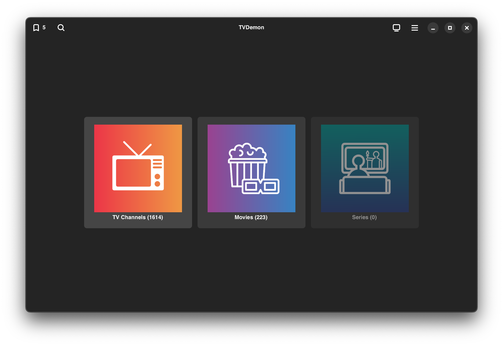

# TVDemon
### TVDemon based on [Hypnotix](https://github.com/linuxmint/hypnotix).  
This is an IPTV streaming application with support for live TV, movies and series.

It can support multiple IPTV providers of the following types:

- M3U URL
- Xtream API
- Local M3U playlist

## Differences from [Hypnotix](https://github.com/linuxmint/hypnotix)
 * GUI redesign. Developed using Gtk4 and [Libadwaita](https://gnome.pages.gitlab.gnome.org/libadwaita/).
 * [GStreamer](https://gstreamer.freedesktop.org/) as default media library.
 * Can be run without installation. 
 * Ability to run on *macOS* and *MS Windows* (via [MSYS2](https://www.msys2.org/) platform).

## Requirements
- Gtk4 >= 4.12
- [Libadwaita](https://gnome.pages.gitlab.gnome.org/libadwaita/) >= 1.4
- Python >= 3.11
- PyGObject (pygobject3)
- Requests (python3-request)
- [GStreamer](https://gstreamer.freedesktop.org/) with Gtk4 plugin (gst-plugin-gtk4).

## Installation and Launch
* ### Linux
  To start the program, in most cases it is enough to download the [archive](https://github.com/DYefremov/TVDemon/archive/refs/heads/main.zip),   
  unpack and run it by double-clicking on the *.desktop file in the root directory,  
  or launch from the console with the command:```./tvdemon.py```   
  Depending on your distro, you may need to install additional packages and libraries.

To create a Debian package, you can use the *build-deb.sh* file from the *build* directory.  

* ### macOS (experimental)  
To run the program on macOS, you need to install [Homebrew](https://brew.sh/).  
Then install the required components via terminal:  
`brew install python3 gtk+4 libadwaita pygobject3 adwaita-icon-theme python-requests gstreamer`

Launch is similar to Linux.


* ### MS Windows (experimental) 
  Windows users can also run (build) this program.  
One way is the [MSYS2](https://www.msys2.org/) platform. You can use [this](https://github.com/DYefremov/TVDemon/blob/main/build/win/BUILD.md) quick guide.  

## TV Channels and media content

TVDemon does not provide content or TV channels, it is a player application which streams from IPTV providers.

By default, TVDemon is configured with one IPTV provider called Free-TV: https://github.com/Free-TV/IPTV.

### Issues relating to TV channels and media content should be addressed directly to the relevant provider.

Note: Feel free to remove Free-TV from TVDemon if you don't use it, or add any other provider you may have access to or local M3U playlists.  

## License

- Code: GPLv3
- Flags: https://github.com/linuxmint/flags
- Icons on the landing page: CC BY-ND 2.0